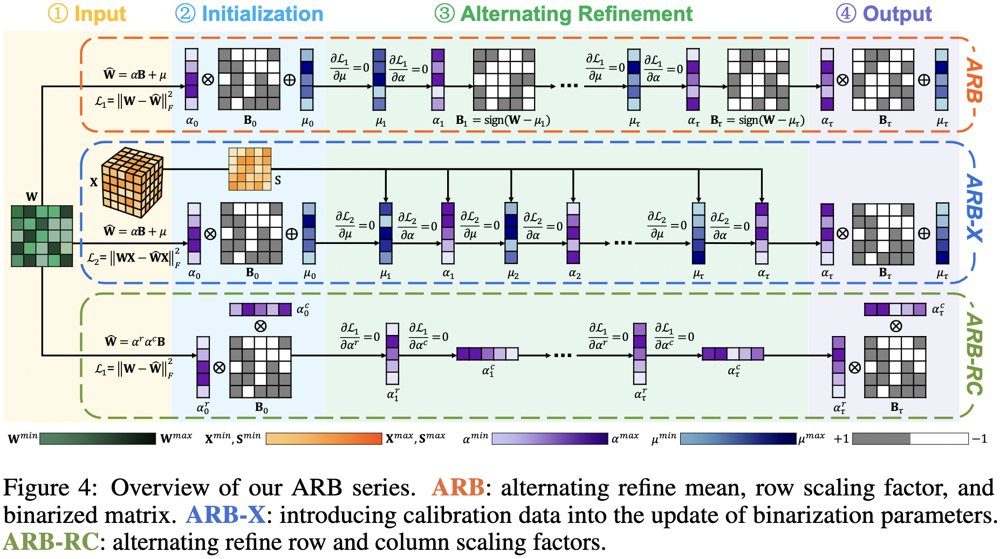
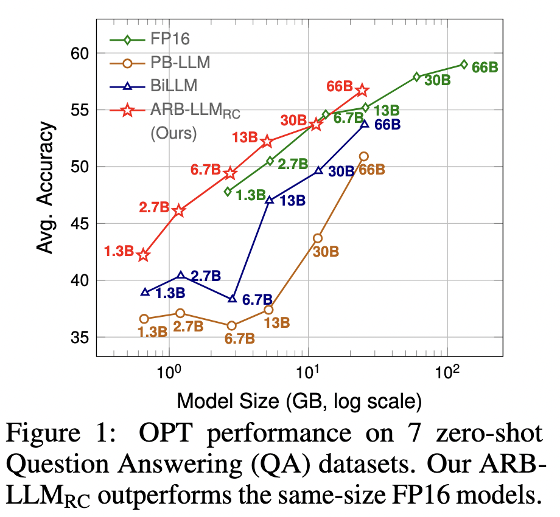
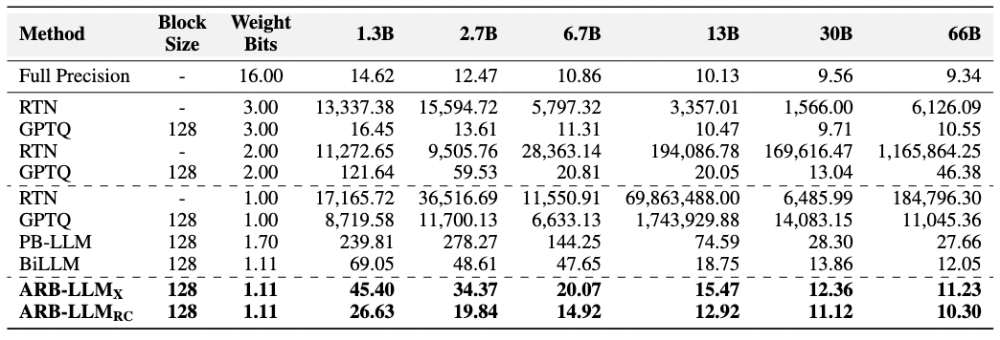
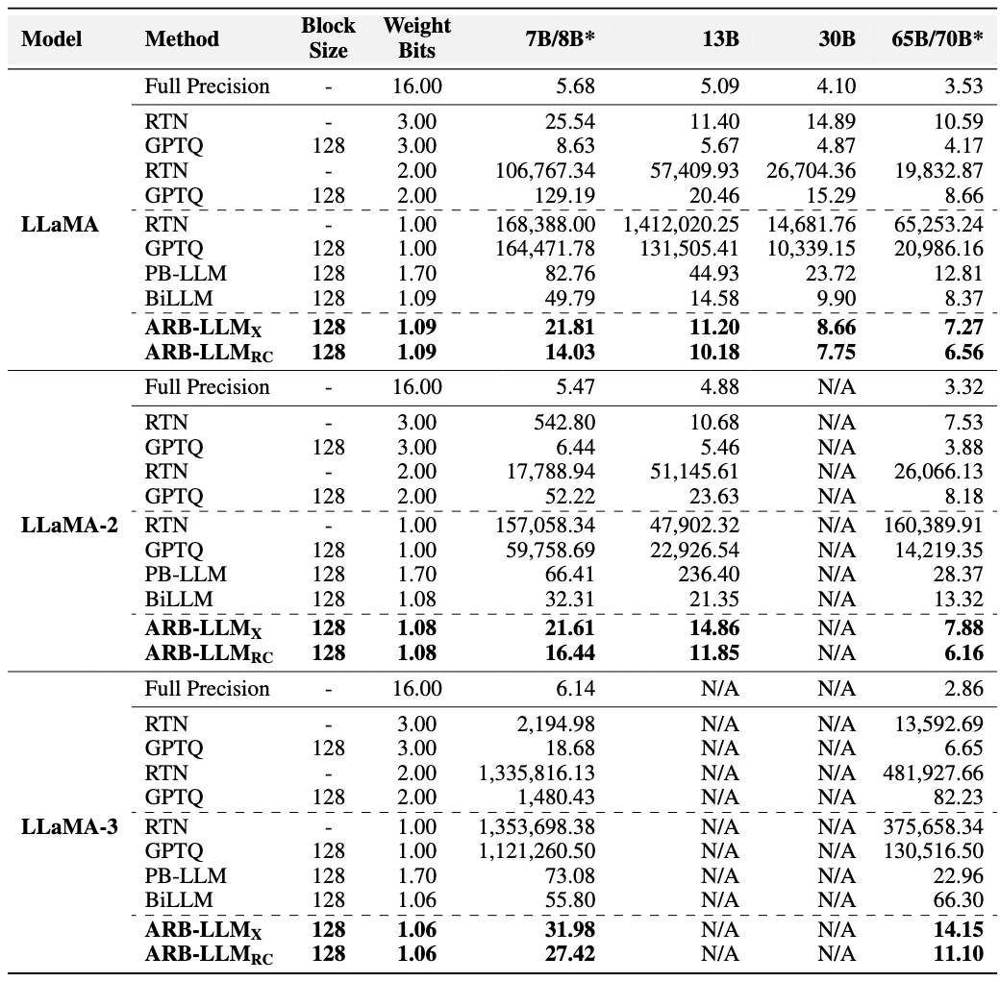
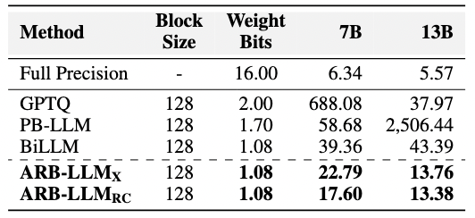
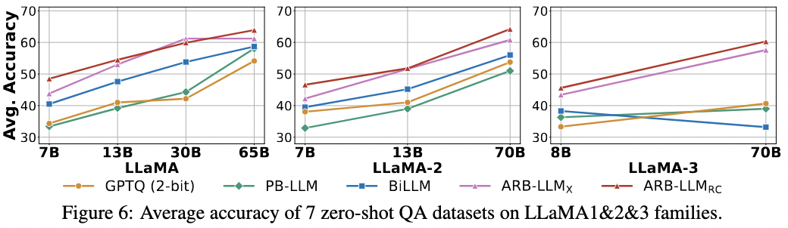

# [ICLR'25] ARB-LLM: Binarizaciones Refinadas Alternantes para Modelos de Lenguaje Grande

[Zhiteng Li](https://zhitengli.github.io), Xianglong Yan, Tianao Zhang, [Haotong Qin](https://htqin.github.io/), Dong Xie, Jiang Tian, Zhongchao Shi, [Linghe Kong](https://www.cs.sjtu.edu.cn/~linghe.kong/), [Yulun Zhang](http://yulunzhang.com/), and [Xiaokang Yang](https://scholar.google.com/citations?user=yDEavdMAAAAJ), "ARB-LLM: Binarizaciones Refinadas Alternantes para Modelos de Lenguaje Grande", ICLR, 2025

[[arXiv](https://arxiv.org/pdf/2410.03129)] [[material complementario](https://github.com/ZHITENGLI/ARB-LLM/releases/tag/v1)]

#### 🔥🔥🔥 Noticias

- **2025-02-16:** El código ha sido liberado. ⭐️⭐️⭐️
- **2025-01-23:** ARB-LLM ha sido aceptado en ICLR 2025. 🎉🎉🎉
- **2024-10-03:** Este repositorio ha sido liberado.

---

> **Resumen:** Los Modelos de Lenguaje Grande (LLM, por sus siglas en inglés) han impulsado significativamente los avances en el procesamiento del lenguaje natural, sin embargo, sus altos requisitos de memoria y computación dificultan su implementación práctica. La binarización, como técnica de compresión efectiva, puede reducir los pesos del modelo a solo 1 bit, disminuyendo significativamente la alta demanda de computación y memoria. No obstante, los métodos de binarización actuales luchan por reducir la brecha de distribución entre los pesos binarizados y los de precisión completa, al tiempo que pasan por alto la desviación por columna en la distribución de pesos de los LLM. Para abordar estos problemas, proponemos ARB-LLM, una nueva técnica de cuantización post-entrenamiento (PTQ) de 1 bit diseñada específicamente para LLM. Para reducir el cambio de distribución entre los pesos binarizados y los de precisión completa, primero diseñamos un algoritmo de binarización refinada alternante (ARB) que actualiza progresivamente los parámetros de binarización, lo que reduce significativamente el error de cuantización. Además, considerando el rol crucial de los datos de calibración y la desviación por columna en los pesos de los LLM, extendemos ARB a ARB-X y ARB-RC. Adicionalmente, refinamos la estrategia de partición de pesos con el mapa de bits por grupo de columnas (CGB), lo que mejora aún más el rendimiento. Al dotar a ARB-X y ARB-RC de CGB, obtenemos ARB-LLM<sub>X> y ARB-LLM<sub>RC> respectivamente, los cuales superan significativamente a los métodos de binarización de estado del arte (SOTA) para LLM. Como método PTQ binario, nuestro ARB-LLM<sub>RC> es el primero en superar a modelos FP16 del mismo tamaño. El código y los modelos estarán disponibles en https://github.com/ZHITENGLI/ARB-LLM. 



---

La Figura 1 del artículo principal demuestra que nuestra propuestaARB-LLM<sub>RC> propuesta supera al método binario PTQ de estado del arte anterior, BiLLM, en todas las escalas de la familia OPT. Además, nuestro modelo binarizado supera a los modelos de precisión completa de tamaño similar. Por ejemplo, la huella de memoria del OPT-13B binarizado es comparable a la del OPT-2.7B de precisión completa, pero el modelo binarizado logra un mejor rendimiento.

<p align="center">
  
</p>

## Dependencias

```bash
# Clone the github repo and go to the default directory 'ARB-LLM'.
git clone https://github.com/ZHITENGLI/ARB-LLM.git
conda create -n arbllm python=3.11
conda activate arbllm
pip install torch torchvision torchaudio
pip install -r requirements.txt
```

## 🔗 Contenido

1. [Cuantización post-entrenamiento y evaluación](#post-training-quantization)
2. [Resultados](#-results)
3. [Cita](#citation)
4. [Agradecimientos](#-agradecimientos)

## Cuantización post-entrenamiento con evaluación de PPL

### Binarización para familias OPT

- ARB-X
  ```shell
  python3 run_arb.py facebook/opt-6.7b c4 arb-x --blocksize 128 --salient_metric hessian --device "cuda:0" --save --num_p 1 --order2_group
  ```

- ARB-RC
  ```shell
  python3 run_arb.py facebook/opt-6.7b c4 arb-rc --blocksize 128 --salient_metric hessian --device "cuda:0" --save --num_p 1 --order2_group
  ```

### Binarización para familias LLaMA

- ARB-X
  ```shell
  python3 run_arb.py meta-llama/llama-2-7b-hf c4 arb-x --blocksize 128 --salient_metric hessian --device "cuda:0" --save --num_p 1 --order2_group
  ```

- ARB-RC
  ```shell
  python3 run_arb.py meta-llama/llama-2-7b-hf c4 arb-rc --blocksize 128 --salient_metric hessian --device "cuda:0" --save --num_p 1 --order2_group
  ```

### Binarización para familias Vicuna (Modelos de Sintonización por Instrucciones)

- ARB-X
  ```shell
  python3 run_arb.py lmsys/vicuna-7b-v1.5 c4 arb-x --blocksize 128 --salient_metric hessian --device "cuda:0" --save --num_p 1 --order2_group
  ```

- ARB-RC
  ```shell
  python3 run_arb.py lmsys/vicuna-7b-v1.5 c4 arb-rc --blocksize 128 --salient_metric hessian --device "cuda:0" --save --num_p 1 --order2_group
  ```

## Evaluación en conjuntos de datos de QA zero-shot

Utilizamos el kit [lm-evaluation-harness](https://github.com/EleutherAI/lm-evaluation-harness) para evaluar el rendimiento en conjuntos de datos de QA. Por favor, consulte su marco de trabajo para evaluar modelos cuantizados.

## 🔎 Resultados

<details>
<summary>ARB-LLM logra un mejor rendimiento de perplejidad en los conjuntos de datos WikiText2. (haga clic para expandir)</summary>

- Familia OPT
<p align="center">
  
</p>

- Familias LLaMA, LLaMA-2 y LLaMA-3
<p align="center">
  
</p>

- Vicuna 7B y 13B
<p align="center">
  
</p>

</details>

<details>
<summary>ARB-LLM logra una precisión media superior en 7 conjuntos de datos de QA zero-shot. (haga clic para expandir)</summary>

<p align="center">
  
</p>

</details>

## Cita

Si encuentra el código útil para su investigación o trabajo, por favor cite el siguiente artículo.

```
@article{li2024arbllmalternatingrefinedbinarizations,
      title={ARB-LLM: Alternating Refined Binarizations for Large Language Models}, 
      author={Zhiteng Li and Xianglong Yan and Tianao Zhang and Haotong Qin and Dong Xie and Jiang Tian and zhongchao shi and Linghe Kong and Yulun Zhang and Xiaokang Yang},
      year={2024},
      eprint={2410.03129},
      archivePrefix={arXiv},
      primaryClass={cs.CV},
      url={https://arxiv.org/abs/2410.03129}, 
}
```

## 💡 Agradecimientos

Este trabajo se publica bajo la licencia Apache 2.0.
El código se basa en [BiLLM](https://github.com/Aaronhuang-778/BiLLM). Por favor, respete también sus licencias. Gracias por su excelente trabajo.
