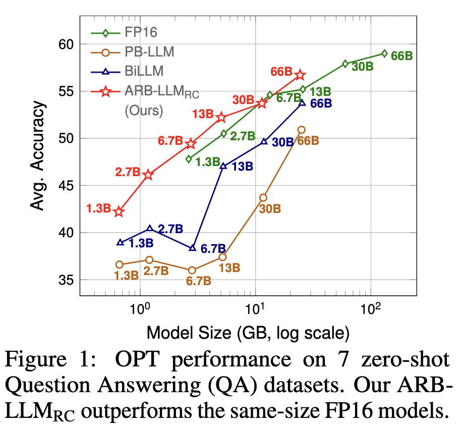
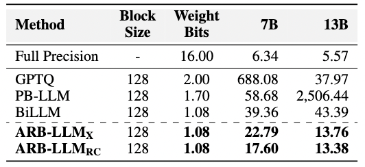

# ARB-LLM: Alternating Refined Binarizations for Large Language Models

[Zhiteng Li](https://zhitengli.github.io), Xianglong Yan, Tianao Zhang, [Haotong Qin](https://htqin.github.io/), Dong Xie, Jiang Tian, Zhongchao Shi, [Linghe Kong](https://www.cs.sjtu.edu.cn/~linghe.kong/), [Yulun Zhang](http://yulunzhang.com/), and [Xiaokang Yang](https://scholar.google.com/citations?user=yDEavdMAAAAJ), "ARB-LLM: Alternating Refined Binarizations for Large Language Models", arXiv, 2024

[[arXiv](https://arxiv.org/pdf/2410.03129
)] [[supplementary material](https://github.com/ZHITENGLI/ARB-LLM/releases/tag/v1)] [visual results] [models]

> **Abstract:** Large Language Models (LLMs) have greatly pushed forward advancements in natural language processing, yet their high memory and computational demands hinder practical deployment. Binarization, as an effective compression technique, can shrink model weights to just 1 bit, significantly reducing the high demands on computation and memory. However, current binarization methods struggle to narrow the distribution gap between binarized and full-precision weights, while also overlooking the column deviation in LLM weight distribution. To tackle these issues, we propose ARB-LLM, a novel 1-bit post-training quantization (PTQ) technique tailored for LLMs. To narrow the distribution shift between binarized and full-precision weights, we first design an alternating refined binarization (ARB) algorithm to progressively update the binarization parameters, which significantly reduces the quantization error. Moreover, considering the pivot role of calibration data and the column deviation in LLM weights, we further extend ARB to ARB-X and ARB-RC. In addition, we refine the weight partition strategy with column-group bitmap (CGB), which further enhance performance. Equipping ARB-X and ARB-RC with CGB, we obtain ARB-LLM<sub>X</sub>
 and ARB-LLM<sub>RC</sub>
 respectively, which significantly outperform state-of-the-art (SOTA) binarization methods for LLMs.
As a binary PTQ method, our ARB-LLM<sub>RC</sub>
 is the first to surpass FP16 models of the same size. The code and models will be available at https://github.com/ZHITENGLI/ARB-LLM. 


---

Figure 1 in the main paper demonstrates that our proposed ARB-LLM<sub>RC</sub> outperforms the previous state-of-the-art binary PTQ method, BiLLM, across all scales of the OPT model family. Furthermore, our binarized model surpasses full-precision models of similar size. For example, the memory footprint of the binarized OPT-13B is comparable to that of the full-precision OPT-2.7B, yet the binarized model achieves better performance.

<p align="center">
  
</p>

---


## ⚒️ TODO

* [ ] Complete this repository

## 🔗 Contents

- [ ] Post-training quantization
- [ ] Models
- [x] [Results](#Results)
- [x] [Citation](#Citation)
- [x] [Acknowledgements](#Acknowledgements)

## 🔎 Results

<details>
<summary>ARB-LLM achieves superior perplexity performance on WikiText2 datasets. (click to expand)</summary>

- OPT family
<p align="center">
  
</p>

- LLaMA, LLaMA-2 and LLaMA-3 families
<p align="center">
  
</p>

- Vicuna 7B and 13B
<p align="center">
  
</p>

</details>

<details>
<summary>ARB-LLM achieves superior average accuracy on 7 zero-shot QA datasets. (click to expand)</summary>

<p align="center">
  
</p>

</details>

## Citation

If you find the code helpful in your research or work, please cite the following paper.

```
@article{li2024arbllmalternatingrefinedbinarizations,
      title={ARB-LLM: Alternating Refined Binarizations for Large Language Models}, 
      author={Zhiteng Li and Xianglong Yan and Tianao Zhang and Haotong Qin and Dong Xie and Jiang Tian and zhongchao shi and Linghe Kong and Yulun Zhang and Xiaokang Yang},
      year={2024},
      eprint={2410.03129},
      archivePrefix={arXiv},
      primaryClass={cs.CV},
      url={https://arxiv.org/abs/2410.03129}, 
}
```

## 💡 Acknowledgements

This work is released under the Apache 2.0 license.
The codes are based on [BiLLM](https://github.com/Aaronhuang-778/BiLLM). Please also follow their licenses. Thanks for their awesome works.
